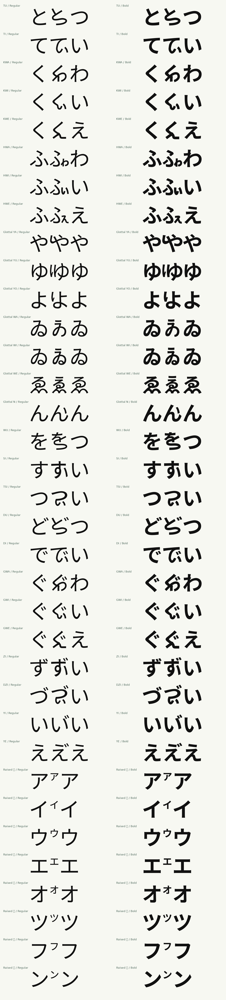

# GenZui Sans Okinawan

GenZui Sans Okinawan supplies the same 27 Funatsu forms and eight raised
katakana as the Serif family, in Regular and Bold. Each sentence-ready face
contains 805 encoded characters: kana, punctuation, Latin, combining marks
and the special forms. The extended full Sans faces contain 17,096 encoded
characters.

## Drawings

The drawings use Noto Sans JP's native Regular and Bold masters at weights
400 and 700. Reduced components use weights 450–900 for optical
compensation. The ふ head and body retain their native dimensions and weight.
TU and WU use continuous strokes through their lower turns, and glottal
WA/WI/WE use the native こ upper-mark contour. WE fits its mark to the
longer ゑ head using the accepted WI mark-to-head relationship. New joining strokes follow cubic skeletons with flat Sans
terminals. Their widths are set separately for each weight. The drawings
reuse no Serif outlines and apply no blanket outline expansion.

`okinawan_sans.py` supplies the drawings and their dakuten placement.
`okinawan.py` shares the mapping, glyph registration, metrics and composition
lookup with Serif. Voiced Funatsu forms use a private-use base followed by
U+3099; YI and YE use ordinary い and え followed by U+3099. Raised katakana
have a half-em advance. See [the mapping registry](../data/okinawan/mappings.json)
for character identities and reference sources.

## Build and proof

Use the ordinary project environment and pinned sources described in the
[README](../README.md):

```sh
.venv/bin/python scripts/sans_okinawan.py
.venv/bin/python scripts/check_sans_okinawan.py
.venv/bin/python scripts/sans_okinawan.py --package
show build/sans-okinawan
```

For the Windows Chrome check, keep the proof registered with `show` and run
`.venv/bin/python scripts/check_sans_okinawan_browser.py`. It uses the existing
GenZui browser registry and verifies the rendered font at every comparison
and sentence, plus the two-column layout at a 390-pixel viewport. It checks
the collapsed groups, Serif references and optical-reference font families and captures the raised-katakana
comparison at a 2× device pixel ratio.

The output directory contains the subset TTF/WOFF2 files, CSS and an editable
proof. The proof shows all 35 forms in two columns, with native kana beside
each drawing, small-size comparisons and dictionary sentence samples. Each
card includes a compact comparison in the matching weight of GenZui Serif
Okinawan 0.118. Those immutable reference webfonts and their notices are
included in the proof package, with hashes checked against the release.
HWA, HWE, YO and WE also show related native and Okinawan forms alongside each
drawing, with a compact Serif row for the same characters. When
`previous/Regular.woff2` and `previous/Bold.woff2` are present, each card also
includes an expandable comparison with that earlier drawing. The package
includes these comparison fonts when available.

HWA/HWI/HWE use separate left dots and right vowel components. HWE uses
a softened え corner with a diagonal and a baseline foot, drawn separately
for Regular and Bold at stroke widths of 66/98 units. The lighter strokes
keep the compact corner and foot from appearing heavier than HWA/HWI. The Bold foot branch
is trimmed to the diagonal's left edge to remove an exposed starting cap.
The family comparison shows all three beside native ふ in both weights.

YU’s glottal mark uses lighter 450/700 donors while retaining its height,
slope and alignment with ゆ’s left stroke. YO uses 475/900 donors at heights
of 480/500 units. Both approved YO drawings are unchanged. WE's upper mark uses 475/725 optical donors. Its length, slope,
left offset and visible midpoint gap follow WI's relationship to its head
bar, fitted to ゑ's longer head. Its reduced body retains 500/800 donors.
TU uses the native 700 donor for its Bold upper stroke. WU Regular uses a
450 donor for the upper body and
a 70-unit return, while Bold retains its 116-unit return. Its upright extends
farther below the crossing. A local correction restores weight lost from
the upper arch during vertical compression, preserving the native tangents.
Bold’s top bar is raised slightly to retain space above the arch. Confirmed
forms (32, including HWE and WE) are collapsed by default. HWA is at the top
with the selected shape in both weights and an expandable previous drawing. Raised Sans
Regular katakana use the approved 450 donor; Bold retains 700. Serif references
use the selected 500/750 raised forms, generated separately from the immutable
0.118 release. Published Serif files are unchanged.

HWA uses the selected native わ curve with its crossbar removed. The cut
closes inside the upright. Its 800/900 donors retain the selected 43%/40%
horizontal scaling and 43% height. Outline strokes of 8/32 units restore
weight in the reduced vowel. The vowel sits 12 units closer to ふ in Regular
and four units closer in Bold, retaining at least 30 units of whitespace. The native ふ parts are unchanged. HWI and
HWE retain their approved drawings after comparison with HWA.

`measure_sans_fu.py` reports `2 × filled area / contour perimeter` for the
compiled vowel contours and native reference kana. This approximates ink
breadth; proportions, junctions and terminals also affect the result, so it
is a comparison aid rather than a perceptual target. The HWA proof includes
the before/after table alongside the full family and native わ/い/え.
The [measurement report](sans-fu-weight-measurements.json) records the font
hashes and readings. Only HWA changes in this spacing revision; its vowel shape and weight are preserved.

`full/` contains the extended full-family faces. The subset ZIP is written to
`dist/GenZuiSansOkinawan-0.104.zip` after validation.

This build extends the immutable Sans 0.103 fonts. It checks their hashes
against the release's validation records and verifies the Noto source files
against the pinned manifest. It preserves the published Sans repertoire
while adding the 26 encoded private-use bases; voiced forms are composition
glyphs. Unreleased gugyeol changes in the general Sans source builder are
outside this extension. The published site and immutable 0.103 files remain
the source for the current release until the new drawings are approved.

## Verification

The checker compares every existing glyph's compiled outline and horizontal
and vertical metrics with Sans 0.103. Every previously encoded character is
also shaped in both directions. It checks the subset repertoire, family
metadata, all 35 forms, native combining sequences and sentence samples,
including TTF/WOFF2 parity. It verifies exact non-intersection of dakuten and
their bases, an additional sampled clearance margin, and separation of the
TSI and HWA strokes that should remain distinct. Detached glottal marks and
vowel strokes have additional minimum-clearance checks in both weights.
The ふ forms are checked for dot/body separation and cell bounds. HWE Bold
also checks that its outer diagonal stays straight through the foot join.
Raised katakana are checked against each donor’s transformed
bounds, including its native baseline overshoot.

These checks establish structural correctness and preservation of existing
characters. Visual review of the joins, counters and balance remains part of
approving new font drawings.

## Character proof


